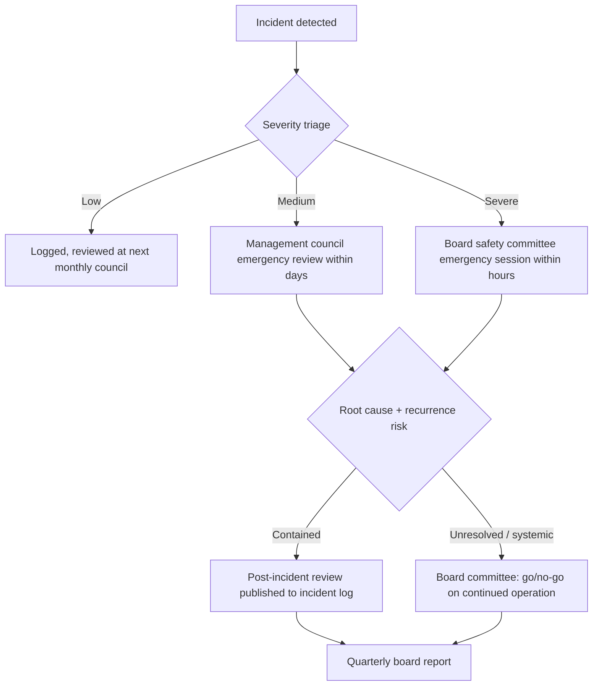

# AI Governance Council — Design Reference

Deep material for `SKILL.md`. Read the section the workflow step points you
to; you don't need to read this file end to end.

**Contents:** [The hybrid model](#the-hybrid-model) ·
[Lessons from real implementations](#lessons-from-real-implementations) ·
[Decision-rights matrix](#decision-rights-matrix) ·
[Conflict-of-interest minimums](#conflict-of-interest-minimums) ·
[Evidence artefacts](#evidence-artefacts) · [Cadence](#cadence) ·
[KPIs](#kpis) · [Jurisdiction lanes](#jurisdiction-lanes) ·
[Templates](#templates) · [Implementation roadmap](#implementation-roadmap) ·
[Sources](#sources)

## The hybrid model

The recommended default is not one committee — it is four roles plus a
documented path between them. Skipping any one of them reproduces a specific,
named failure (see next section).

| Layer | Composition | Authority | Cadence |
| --- | --- | --- | --- |
| Management AI Council | 7–10 cross-functional: engineering, product, safety, security, privacy, legal, compliance, risk. Staggered 1–3 year terms so the whole body never turns over at once. | Routine review and approval of ordinary launches; recommends up when a case hits an escalation trigger. | Monthly ordinary + ad-hoc |
| Board Safety Committee | 3–5 members, majority independent of management, at least one with genuine technical depth (not just "reads the memo"). | Binding on frontier launches, safeguard waivers, and severe incidents; can reverse or delay a management council decision. | Quarterly + emergency within hours |
| External Review Panel | 2–5 outside experts, conflict-screened (financially disinterested — see COI section). | Mandatory input (not just optional courtesy) for defined trigger cases: frontier capability, novel harm class, active regulator inquiry. | Per trigger case |
| Responsible AI office | Standing staff function, not a committee. | Owns process design, artefact quality, agenda-setting, tracking launch conditions to closure. No independent decision authority — it runs the machine, it doesn't sit on it. | Continuous |

Plus a **documented escalation ladder**: every case has a defined path from
"management council reviews" to "board committee must review" with named
trigger conditions (see [Decision-rights matrix](#decision-rights-matrix)),
not an ad hoc "escalate if it feels important" rule.

Governance succeeds only when **all three decision layers are present at
once**: operational review (management council), escalation authority (board
committee), and independent challenge (external panel). Each missing layer
has its own named failure mode — see below.

## Lessons from real implementations

Encode these as design ingredients, not case studies to summarize at length.

- **Microsoft** — impact assessments embedded directly in the product
  lifecycle (not a side process), a Sensitive Use / Restricted Use routing
  system that flags certain applications for mandatory extra review, and a
  standing Office of Responsible AI that owns the process. Ingredient: make
  the review a lifecycle gate, not an optional consult.
- **OpenAI** — a Safety Advisory Group that recommends; leadership decides;
  a board-level safety committee retains the power to reverse or delay a
  launch. Ingredient: separate the recommending body from the deciding body,
  but give the deciding body real teeth above leadership.
- **Anthropic** — a Long-Term Benefit Trust structure, a named Responsible
  Scaling Officer role, public risk reports, and external review built into
  the scaling policy. Ingredient: name an accountable individual role, not
  just a committee, and publish enough to be checked from outside.
- **Meta Oversight Board** — independence from the parent company, public
  reasoning for decisions, explicit recusal rules, 3-year terms capped at 9
  years total. Ingredient: term limits and public reasoning are what make
  "independent" mean something rather than being a label.
- **US federal agency AI governance boards** — mandated cross-functional
  composition and independent review required *before* an agency accepts
  risk on a high-impact AI use case. Ingredient: independent review is a
  precondition for risk acceptance, not a parallel-track audit that happens
  later.
- **Google ATEAC (cautionary)** — an external advisory council assembled
  without a legitimacy model (unclear mandate, unclear composition
  rationale, no recusal process) collapsed within days of announcement.
  Ingredient (negative): an external panel bolted on without legitimacy
  design is worse than no panel — it invites exactly the backlash it was
  meant to prevent.

**Named failure modes**, one per missing layer — use these to critique a
proposed design that's missing a piece:

| Missing layer | Failure mode | What it looks like |
| --- | --- | --- |
| Escalation authority | Advisory theatre | Council recommends, nothing binds, risk ships anyway |
| Informed operational review | Uninformed executive veto | Board says yes/no without operational detail to do it well |
| Legitimate external challenge | Brittle/performative challenge | Panel exists on paper, collapses under real pressure (see ATEAC) |

## Decision-rights matrix

Tier by risk, not by team or by who asks. Consensus where achievable; simple
majority for routine votes; supermajority required to override a documented
"do not launch" recommendation from safety, security, or privacy leads.
Recorded dissent is mandatory whenever a vote isn't unanimous — silence is not
consent.

| Risk tier | Example | Approval path | Vote threshold |
| --- | --- | --- | --- |
| Low-risk update | Prompt tweak, minor UX copy change in an existing AI feature | Delegated approval (named individual, no meeting) | N/A — logged, not voted |
| Medium feature launch | New AI feature in an existing product surface | Management council vote | Simple majority |
| High-impact / regulated | Automated decisions affecting eligibility, pricing, employment, safety | Full council review + mandatory board notice (board does not need to vote, but must see it) | Council supermajority |
| Frontier capability | New model capability class, or capability the org hasn't shipped before | Mandatory board safety committee review | Board majority, independents concur |
| Safeguard waiver | Any request to ship despite an unmet minimum safeguard | Mandatory board safety committee review | Supermajority, dissent logged regardless of outcome |
| Severe incident response | Post-incident go/no-go on continued operation | Mandatory board safety committee, emergency session | Supermajority |

## Conflict-of-interest minimums

- Annual COI disclosure **and** per-item/per-decision disclosure — annual
  alone misses new conflicts created mid-year.
- A recusal register: who recused, from what, why — kept as a durable record,
  not a verbal note in a meeting.
- The chair must not own a shipping target under review — chairing and
  owning the thing being judged is a structural conflict regardless of the
  individual's integrity.
- Compensation for council/committee members must be independent of the
  outcome of the decisions they make (no bonus tied to "launches approved" or
  similar).
- External reviewers must be financially disinterested — no equity, no
  consulting revenue contingent on a favorable outcome, disclosed and
  checked, not just self-attested.

## Evidence artefacts

The minimum set a functioning council must produce — treat "we meet
regularly" as insufficient without these:

1. Charter + decision-rights matrix (this document, adapted).
2. AI inventory — a live list of what AI systems exist, at what risk tier.
3. Impact assessment / risk report per launch above the low-risk tier.
4. Launch decision memo, including the dissent log for that decision.
5. Incident log + post-incident review for every triggered incident.
6. Quarterly board report summarizing the above.
7. Annual public summary (scope and depth vary by org — even a short public
   statement of principles and metrics builds external trust).

Model Cards and Datasheets for Datasets are the standard documentation
foundation to require underneath the impact assessments — reference them by
name rather than reinventing a documentation format.

## Cadence

| Cadence | Purpose |
| --- | --- |
| Monthly | Ordinary management council review |
| Quarterly | Deep-dive (board committee reviews trend data, not just cases) |
| Ad-hoc, within hours | Emergency session for a severe incident |
| Annual | Charter review |
| Annual | One severe-incident simulation/tabletop exercise |

Do not recommend adding meetings as a proxy for rigor — cadence exists to
keep the evidence artefacts current, not as an end in itself.

## KPIs

Judge the council by outcomes, not attendance.

| KPI | Target |
| --- | --- |
| Review coverage | 100% of in-scope launches reviewed |
| Decision latency | ≤10 working days ordinary; ≤48h urgent |
| Dissent visibility | 100% of decisions with dissent have it logged and visible |
| Launch-condition completion | ≥95% of conditions attached to an approval actually closed out |
| Incident recurrence | Trending down release over release |
| Audit-trail completeness | ≥95% of decisions have a complete evidence trail |

## Jurisdiction lanes

**All facts in this section are time-sensitive as of mid-2026 — verify
against the official source before relying on any date or threshold.** One
global charter with jurisdiction annexes is the recommended structure;
where rules conflict, the stricter control wins across the whole org rather
than running separate processes per region.

- **US** — no single federal AI statute. NIST AI RMF plus its Generative AI
  Profile is the closest thing to a common baseline. OMB guidance governs
  federal agencies specifically (Chief AI Officers, governance boards,
  independent review required before accepting risk on high-impact use).
  FTC and EEOC enforce existing law (deception, discrimination) against AI
  systems without new AI-specific statutes. A growing set of state laws
  (e.g. Colorado's automated decision-making law) add sector- or
  state-specific obligations — check state law where the org operates.
- **EU** — the AI Act entered into force 1 Aug 2024; prohibitions and AI
  literacy obligations applied from 2 Feb 2025; GPAI (general-purpose AI
  model) obligations applied from 2 Aug 2025; the Act becomes fully
  applicable 2 Aug 2026. A voluntary GPAI Code of Practice offers a
  compliance route for general-purpose model providers. Verify current
  phase-in status — this timeline is exactly the kind of fact that moves.
- **UK** — a principles-based, regulator-led regime rather than one AI
  statute: five cross-sector principles applied by existing regulators, plus
  ICO guidance specifically on AI and data protection, and an AI Cyber
  Security Code of Practice for security-specific obligations.
- **China** — the Interim Measures for the Management of Generative AI
  Services require content labeling and, for services with public-opinion or
  social-mobilization properties, security assessment and filing. Separate
  algorithmic recommendation provisions apply to recommender systems. Use
  local counsel for China operations — this is the jurisdiction where
  informal practice diverges most from the text of the rules.

## Templates

### Charter (skeleton)

```
1. Purpose and scope (which AI systems/launches this charter governs)
2. Bodies and composition (management council / board committee / external panel)
3. Decision rights (link to the decision-rights matrix)
4. Membership terms and rotation
5. Conflict-of-interest policy (link to COI policy below)
6. Meeting cadence and quorum
7. Evidence artefacts required per decision
8. Escalation triggers and ladder
9. Jurisdiction annexes
10. Annual charter review commitment
```

### Conflict-of-interest policy (skeleton)

```
1. Disclosure: annual, plus per-item before each vote
2. Recusal: trigger conditions, recusal register, chair-specific rule
   (chair may not own a shipping target under review)
3. Compensation independence: no outcome-linked pay for council/committee members
4. External reviewer screening: financial-disinterest check, documented
5. Review: COI policy itself reviewed annually alongside the charter
```

### Decision-rights matrix (starting template — resize to the org)

| Tier | Trigger | Approver | Threshold |
| --- | --- | --- | --- |
| 1 — Low | Minor update to existing AI feature | Delegated individual | Logged only |
| 2 — Medium | New AI feature launch | Management council | Simple majority |
| 3 — High | High-impact/regulated use | Council + board notice | Supermajority |
| 4 — Frontier | New capability class | Board safety committee | Board majority |
| 5 — Waiver/incident | Safeguard waiver or severe incident | Board safety committee (emergency) | Supermajority |

### Incident escalation flow



### Meeting agenda (management council, ordinary)

```
1. Open items from last meeting (launch-condition closeout status)
2. New launch reviews at tier 2+ (decision-rights matrix)
3. Incident log review (any new entries since last meeting)
4. AI inventory changes
5. Escalations to raise with the board committee
6. KPI snapshot (coverage, latency, dissent visibility, recurrence)
```

### Implementation roadmap

```
1. Mandate — get executive sponsorship and a named charter owner
2. Stand up — recruit management council + board committee membership,
   ratify charter and COI policy
3. Pilot — run 3-5 real launch reviews through the new process before
   declaring it live; fix the process based on what breaks
4. Operationalise — wire the AI inventory, decision memo template, and
   incident log into normal launch workflow
5. Annual assurance — charter review, incident simulation, KPI report
```

Staffing and budget sizing are org-specific — do not attach fixed headcount
or dollar figures here; size the council and office to the org's launch
volume from the workflow's scoping step.

## Sources

Framework and organization names to cite directly rather than paraphrasing
from any internal note:

- NIST AI Risk Management Framework — nist.gov
- ISO/IEC 42001 (AI management systems standard)
- US OMB guidance on federal agency AI governance — whitehouse.gov
- Microsoft Responsible AI program — microsoft.com/en-us/ai/responsible-ai
- OpenAI Preparedness Framework — openai.com
- Anthropic Responsible Scaling Policy — anthropic.com/responsible-scaling-policy
- Meta Oversight Board — oversightboard.com
- EU AI Act — digital-strategy.ec.europa.eu (or artificialintelligenceact.eu
  for a plain-language explainer)

